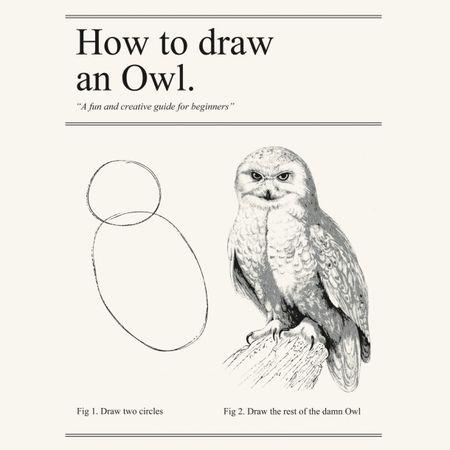
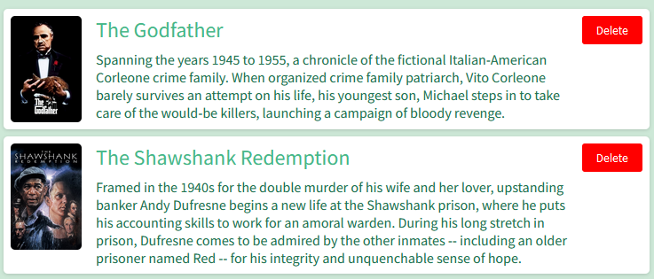

# Exercise 5 - Deleting movies

In this exercise, you will create a delete button in the form to delete movies.

The support wheels are coming off now, and you will have to use what you have learned so far, combined with doing your own research in order to solve the exercise.



## 5.1 Add a delete operation to the API

:pencil2: Create a new API endpoint for deleting a movie. Below is a skeleton route for a a delete endpoint. Notice how the `id` parameter is extracted from the path using `req.params`. Simply log out a message to the console when the request is received for now.

```javascript
router.delete('/movie/:id', async (req, res) => {
  const movieId = req.params.id;
  res.sendStatus(200);
})
```

## 5.2 Add a delete button

:pencil2: Create a button for each movie card for deleting a movie. Call your new API endpoint. Check that your new endpoint was triggered by your request.
The resulting UI might look something like this



## 5.3 Implement business logic for deleting a movie and update UI

:pencil2: In your backend, implement deleting a movie from the data source. In your frontend code, remove the DOM element representing the movie if the request to the API was successful.

After finishing this part, you should be able to delete a movie and see that it is gone when you refresh the page.
