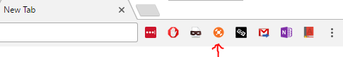
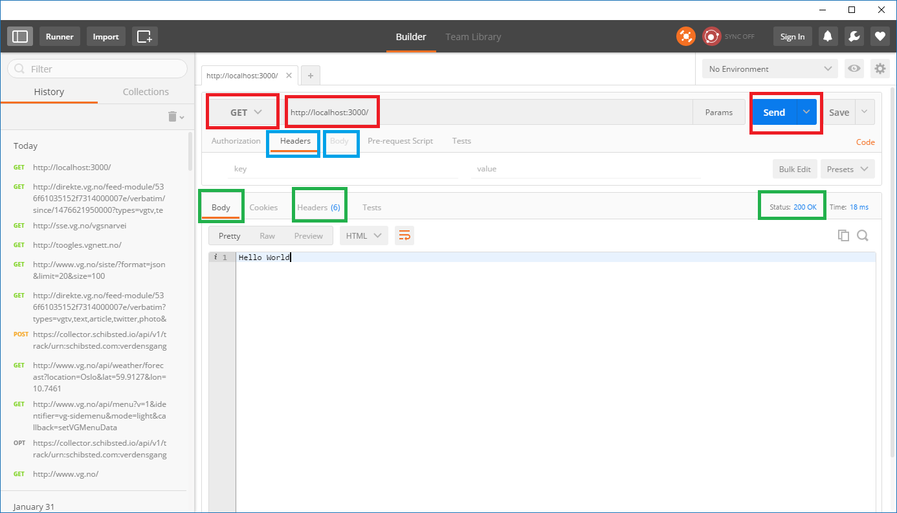

# Exercise 1 - Up and running
In this exercise you will create the basic project structure and files required for the next exercises.

You will learn to:

- Install NodeJS
- Initializing Git and npm for your project
- Create a basic web server using NodeJS and Express
- Verify that the web server is working by using the Postman plugin for Chrome

## 1.1 Install software

### 1.1.1 NodeJS
NodeJS is the platform/runtime that's going to run our web server. You can test if you already have NodeJS installed
by opening a terminal and entering `node -v` which should return a version number if it's installed.

If you don't have NodeJS installed, you can [download it here](https://nodejs.org/en/).

:exclamation: If you have Node installed with a version less than 8, please upgrade to the latest before continuing.

### 1.1.2 Git
We're going synchronize our project with GitHub, so make sure you have Git installed.  
:pencil2: Test if you have Git installed by opening a terminal and entering `git --version` which should return a version number if it's installed. If not, [download Git here](https://git-scm.com/).

#### 1.1.2.1 GitHub
:pencil2: Create a [GitHub account](https://github.com/) if you don't already have one.

### 1.1.3 Chrome
:pencil2: [Install Google Chrome if you don't have it](https://www.google.com/chrome/browser/desktop/)

### 1.1.3.1 Postman
Postman is a Chrome extension you will use to test your REST interface. It allows us to create web requests without having a website.  
:pencil2: [Install Postman here](https://chrome.google.com/webstore/detail/postman/fhbjgbiflinjbdggehcddcbncdddomop?hl=en).

## 1.2 Create project and initialize frameworks
In this workshop you'll create everything yourself from scratch so you can see how all the pieces are assembled and come together.

Let's start with making a new Git repository on GitHub. When we make a project we can choose to initialize Git in two ways:
  1. We can do `git init` in the project directory locally, which will create a local Git repository. Then we can create a repository on GitHub and in our local repository add GitHub as the _remote_ which will link the two repositories together.
  2. Or, as we will do below, we can make the GitHub repository first, then clone it locally to our computer.

Both options result in the same set-up. Typically we do option 1 when we already have a codebase we want to push to GitHub, and option 2 when we are starting fresh. Let's continue with option 2.

### 1.2.1 Creating a new git repository
:pencil2: Go to GitHub and [create a new repository](https://github.com/new). Give it a name, check the box for adding a readme file and in the _Add .gitignore: None_ dropdown list, select _Node_ and click the _Create repository_ button. 
:pencil2: In the newly created repository, click the green _Clone or download_ button and copy the URL. 
:pencil2: Open a terminal on your computer in a folder where you want to store this project and clone the GitHub repo here: `git clone [URL]`  
:pencil2: In the terminal, go into the new project directory. There should be a _README.md_ and a _.gitignore_ file there aswell as a _.git_ folder. Files and folders starting with `.` is hidden by default, but they're there. Now we have a completely empty project that we can work in.

### 1.2.2 Initializing the Node Package Manager (npm)

#### 1.2.2.1 npm
Npm is an additional tool we get when we install NodeJS (the JavaScript runtime). We use npm to install and manage dependencies in our project. Our project's Node-related meta information, tasks, and list of dependencies is kept in a `package.json` file. The following steps will create this file from scratch.

:pencil2: In the terminal you already have open in your project directory, type `npm init` to start the process of creating the file. The first entry is the project's name. It'll suggest the name of the folder you're in. Just hit Enter if this is fine, or type another name. 
:pencil2: Next is the version, just hit Enter to keep _1.0.0_ as the starting version. 
:pencil2: Then there is the description. Type something that describes the project and hit Enter. 
:pencil2: Next is the entry point, meaning where is the start of your package. (In Java/C#-speak: where is your `static void Main(string[] args)`). Type in `server.js` and hit Enter. 
:pencil2: Finish the rest of the steps with the info you like. When finished you should have a `package.json` file in your project directory looking something like this:

~~~~json
{
  "name": "nerdschool-modernjs",
  "version": "1.0.0",
  "description": "Building a REST-based web server",
  "main": "server.js",
  "scripts": {
    "test": "test"
  },
  "repository": {
    "type": "git",
    "url": "git+https://github.com/eaardal/nerdschool-modernjs.git"
  },
  "keywords": [
    "rest",
    "http",
    "web",
    "fun"
  ],
  "author": "Eirik Årdal",
  "license": "ISC",
  "bugs": {
    "url": "https://github.com/eaardal/nerdschool-modernjs/issues"
  },
  "homepage": "https://github.com/eaardal/nerdschool-modernjs#readme"
}
~~~~

:pencil2: In your terminal, add the package json to Git, then make a new commit and push it to GitHub.
~~~~
$ git add package.json
$ git commit -m "Added a fancy package.json file"
$ git push origin master
~~~~
When you refresh the repository on GitHub there should now be a package.json file there.

#### 1.2.2.2 Dependencies
One of the huge benefits of working with JavaScript these days is the abundance of third-party libraries and frameworks.

The first thing we need is a web server. "But wait, I thought NodeJS is the web server", you say. Not really - NodeJS is the JavaScript _runtime/platform_ which we can run a JavaScript-based _web server_ on. NodeJs is more like a virtual machine that we can run other software on top of.

We're going to use the web server [_Express_](http://expressjs.com/) which is one of the most used and most popular available for NodeJS.

:pencil2: In the terminal type `npm install express --save`.

Two things should happen: First, `express` should be listed in the _dependencies_ section in your `package.json` file (because we installed using `--save`). Second, a new `node_modules` directory was created in our project. This directory has lots of other directories. This is where all npm packages for your project is installed to. You'll find the _express_ directory there, and all the other directories are express's dependencies.

By adding the `-g` switch when doing `npm install`, we can install the package globally on the computer instead of to the current directory. For example: `npm install -g typescript` (or shorter: `npm i -g typescript`) will install the TypeScript language globally on our computer. But let's not do that now!

You might think the huge _node_modules_ directory will make our git repository massive in size, but if you type `git status` in your terminal, only the package.json file has changed. Node_modules is never checked in to git (_node__modules_ is listed in the _.gitignore_ file which lists files and folders git will ignore). It is only ever generated locally when we do `npm install` as part of beginning working on a project. A typical workflow for working on someone else's project is

:exclamation: If node_modules or anything in it shows up when you type `git status`, node_modules is probably not listed in your .gitignore file. If this is true, do the following steps: 
 :pencil2: Add the line "node_modules/" to your .gitignore file before continuing if it's not already listed and make sure you don't check anything in this folder into Git. 
:pencil2: Let's check this change in to git by repeating the same steps as before: add the file to git, make a commit, push to github.

## 1.3 Creating a web server using Express

:pencil2: In your project directory, create a new file `server.js`. 
:pencil2: In server.js, we're going to _require_ express: `const express = require('express');`, which will let us use Express in the `server.js` _module_ (as in a JavaScript _module_). This is equivalent to `import` or `using` in other languages. 
:pencil2: Then we will use express: `const app = express();`. 
:pencil2: Next, we will make a simple REST endpoint which will answer all `GET` requests at the root path (`/`) of our domain. This means if our web server is running on `http://localhost:3000`, then this endpoint will answer all `GET` requests to `http://localhost:3000/` aka the root. For now, we'll just return the text _Hello World_:

~~~~javascript
app.get('/', (request, response) => response.send('Hello World'));
~~~~

Alternatively, we could write the above this way using a _function_ instead of a _lambda/arrow function_. The below is exactly the same as above:

~~~~javascript
app.get('/', function (request, response) {
  response.send('Hello World');
});
~~~~

:pencil2: We're going to finish of by telling express to start listening for requests on a port we choose:

~~~~javascript
const port = 3000;
app.listen(port, () => {
  console.log(`Example app listening on port ${port}`); // Note the `` backticks is NOT the same as single quotes ''
});
~~~~

The finished `server.js` file should look like this:

~~~~javascript
const express = require('express');
const app = express();
const port = 3000;

app.get('/', (request, response) => response.send('Hello World'));

app.listen(port, function () {
  console.log(`Example app listening on port ${port}`);
});
~~~~

:pencil2: In your terminal, type `node server.js` to get node to run your new express web server. 
:pencil2: In Chrome, go to http://localhost:3000/ and you should see the text _Hello World_.

### 1.3.1 Testing with Postman

After installing Postman you should have a new button at the Chrome address bar to access it:

:exclamation: If you can't find it, go to [chrome://extensions/](chrome://extensions/) and make sure it's enabled.

:pencil2: Spend a few minutes by making yourself familiar with the interface.

To the left is the log of the last requests and responses you did in Chrome. Postman acts as a proxy for all communication in Chrome, so as you visit a webpage, it'll show up in Postman's History view.

In the center, starting from the top is an address bar and a dropdown where you can choose what kind of http verb you want to use. Below the address bar (blue) are options for filling out meta information and data to send along in the request. The Send button will send the request with it's headers and body.

After a request has been sent, the response is shown below (green). You can see the body and headers of the response (green), the status code, and the data.

:pencil2: With the express server still running in your terminal, enter its Hello World url into Postman, select GET as the http verb, and click Send. Verify you get Hello World with a 200 OK response back.

## 1.4 Finishing up
Now that we have a working web server, let's make sure we're keeping everything in our project up to date, _including some documentation_. It's common to include a short "how to get starting" section in the front-page readme on GitHub so that others can see how they can get your project up and running, and to remind yourself when you haven't worked on it for 3 months and can't remember a thing.

:pencil2: Open `README.md` in your project. Write a simple list of how someone can start your web server from scratch. It should include the exact terminal commands of how to:
  - Get the code from GitHub
  - Install dependencies
  - Start the web server. 

:pencil2: Complete the exercise by committing all new and changed files to git, then push it to GitHub. See that GitHub now show the content of the readme file on the repository's front page.

Now that we're all set-up, let's implement some features!

### [Go to exercise 2 :arrow_right:](../exercise2/README.md)
