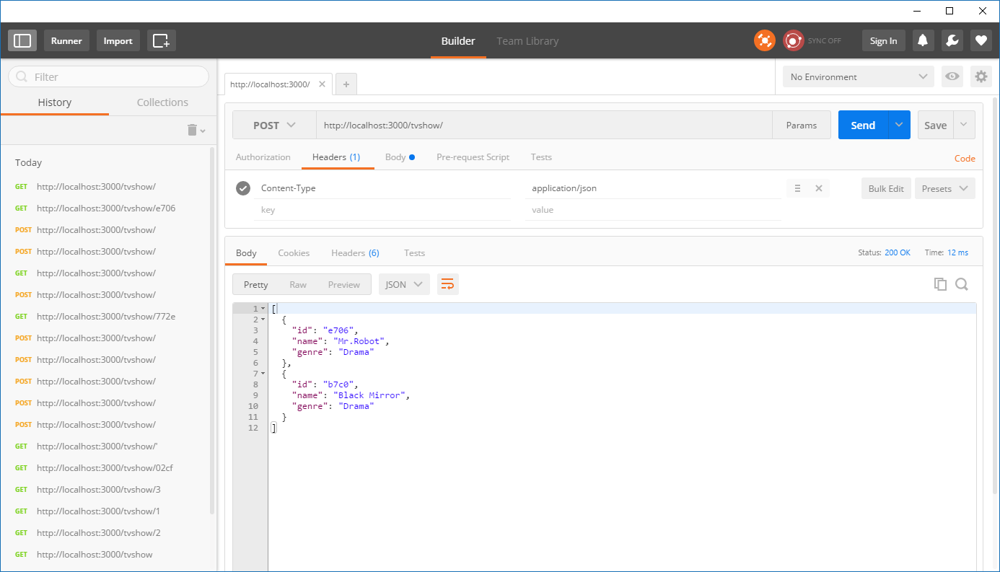
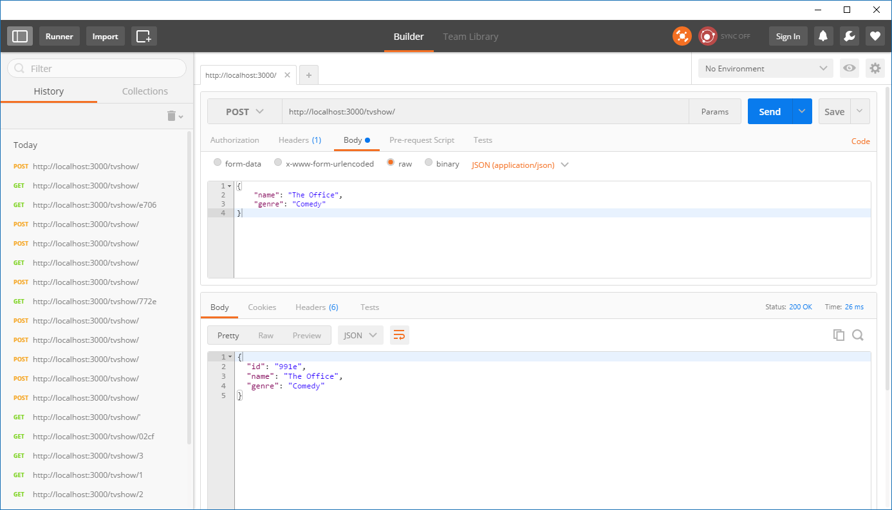

# Exercise 2 - Making a REST API for TV Shows
In this exercise you will create a full REST API to work with TV Shows.

:exclamation: In this exercise you will continue on the project you started in exercise 1. No need to create something new.

You will learn to:

- Make an endpoint for fetching all tv shows
- Make an endpoint for fetching a tv show by it's ID
- Make an endpoint for inserting a new tv show
- Make an endpoint for deleting an existing tv show
- Make an endpoint for updating an existing tv show

## 2.1 Discussing a _resource_

When working with REST, we often talk about _resources_. We say we want to _make a REST API for a resource_. What is a resource?
A resource is an entity we make REST operations for. We can have many resources in our application. In this workshop, _tv show_ and _review_ are our _resources_. In this exercise, our resource is _tv show_.

The urls we use for a REST API reflect our _resources_ along with the correct _http verb_. For example, above we listed a set of operations we will learn in this exercise. The following is how we expect to implement and use our REST API for the tv show resource:

- _Get all_ tv shows: `GET http://localhost:3000/tvshow/`
- _Get single_ tv show: `GET http://localhost:3000/tvshow/{id}/`
- _Insert_ a tv show: `POST http://localhost:3000/tvshow/` (The tv show data we will insert is in the request's _body_)
- _Delete_ a tv show: `DELETE http://localhost:3000/tvshow/{id}/`
- _Update_ a tv show: `PUT http://localhost:3000/tvshow/{id}/` (The tv show data we will insert is in the request's _body_)

REST is all about leveraging the power of plain HTTP and how the web works. The combination of HTTP verbs, routes, and request/response is the essence of it. Instead of making a complicated proprietary standard that languages and platforms must implement, we just use the internet. A resource is defined by it's route, it's accessed by using the correct http verb, and data is transferred in the request and response body.

## 2.2 Better logging

A helpful tool when developing is to log what's going on during runtime of our application. Since we are working with a web server in a console/terminal environment, let's get it to log all requests there so we can see what's going on.

We're going to use the library [_Morgan_](https://github.com/expressjs/morgan) to do this for us.

:pencil2: Install Morgan: `npm install morgan --save` 
:pencil2: In `server.js`, _require_ morgan: `const morgan = require('morgan');`. 
:pencil2: In `server.js`, _use_ morgan: `app.use(morgan('dev'));`. "Dev" is a pre-set log configuration which gives short, concise log statements suitable for development. You can [try out other configurations if you want](https://github.com/expressjs/morgan#api). 
:pencil2: Restart the web server and invoke a few requests using Postman. See in your terminal that it now logs. 
:pencil2: Git commit the changes, push to github. 

Example of output:

## 2.3 Preparing for JSON

It's common in the modern JavaScript and NodeJS world that an application is made up of many small pieces that you wire together as you need.

One of the pieces we need to wire up now is proper JSON handling for Express. For this, we need a new library, `body-parser`.

:pencil2: Install body-parser: `npm i body-parser --save`. (`i` is a shorter alias for `install`). 
:pencil2: In `server.js`, _require_ body-parser: `const bodyParser = require('body-parser');`. 
:pencil2: In `server.js`, _use_ body-parser: `app.use(bodyParser.json());`. 

## 2.4 Make a endpoint for fetching all tv shows

### 2.4.1 Introducing a Router

It's good practice to separate functionality into smaller modules which has a single and clear responsibility. Let's do this by separating all REST functionality that has to do with the tv show resource into it's own _tv show router_. 

:pencil2: In `server.js`, add another _require_ statement at the top: `const tvShowRouter = require('./tvShow/tvShowRouter');`. This doesn't exist yet. 
:pencil2: In `server.js` where we set-up our routes, add the new `tvShowRouter` to handle all requests to the `/tvshow` path: `app.use('/tvshow', tvShowRouter);`.

Your `server.js` file should now look something like this:

~~~~javascript
const express = require('express');
const bodyParser = require('body-parser');
const morgan = require('morgan');
const tvShowRouter =  require('./tvShow/tvShowRouter');

const app = express();
const port = 3000;

app.use(morgan('dev'));
app.use(bodyParser.json());

// Exercise #2
app.use('/tvshow', tvShowRouter);

// Exercise #1
app.get('/', (request, response) => response.send('Hello World'));

app.listen(port, () => {
  console.log(`Example app listening on port ${port}`);
});
~~~~

### 2.4.2 TV Show model

We need something to represent a TV Show and carry data for a tv show. We call this a _model_. Let's use a fancy ES6 class to make this.

:pencil2: Create a new folder: `tvShow`. 
:pencil2: Create a new file `TvShow.js` inside this new folder. This file should just contain our tv show _model_:

~~~~javascript
class TvShow {
  constructor(id, name, genre) {
    this.id = id;
    this.name = name;
    this.genre = genre;    
  }
}
module.exports = TvShow;
~~~~

:exclamation: Note the `module.exports = TvShow` line. Remember that a `.js` file is equal to a javascript _module_ and by default, all members in a module is private. So in order to be able to _import_ our TvShow class, we need to export it - to make it public.

### 2.4.3 TV Show Router

This will handle everything web related that has to do with the tv show resource.

:pencil2: Make a new file `tvShowRouter.js` inside the `tvShow` folder. 
:pencil2: Import express: `const express = require('express');`. 
:pencil2: Import the TvShow model class: `const TvShow = require('./TvShow');`. (When we import local _modules_ we use the filename sans the extension: `TvShow.js -> require('TvShow')`. The relative path to the file is also important. Here the file is in the same directory: `./[name of file]`). 
:pencil2: Create a new instance of an express Router: `const tvShowRouter = express.Router();`. 
:pencil2: Create a new array to hold our tv shows: `const tvShows = [];`. We're going to split this out into another file later, but let's play around with it a bit first. 
:pencil2: Make a couple of dummy tv shows in the array for now: `const tvShows = [new TvShow(1, 'Mr.Robot', 'Drama'), new TvShow(2, 'Black Mirror', 'Drama')];`. 
:pencil2: Make a route for _fetching all tv shows_: `GET http://localhost:3000/tvshow/`: 
:pencil2: Remember to _export the router so it's possible to `require()` it from other modules_.

~~~~javascript
tvShowRouter.get('/', (req, res) => {
  res.json(tvShows);
});
~~~~

:book: What is `(req, res)`? This is the _request_ and _response_ objects. Naming of parameters is irrelevant in JavaScript so these shorter terms are used alot when working with Express.

:book: What is `res.json(tvShows)`? Here we say that _take my tvShows array, parse it to json, and set it as my response's body aka the response data_.

:pencil2: Start the web server again: `node server.js`. 

:pencil2: In Postman, select the http verb `GET` and enter `http://localhost:3000/tvshow/`. 

The response should have a status code 200 OK and the body should contain this JSON content:
~~~~json
[
  {
    "id": 1,
    "name": "Mr.Robot",
    "genre": "Drama"
  },
  {
    "id": 2,
    "name": "Black Mirror",
    "genre": "Drama"
  }
]
~~~~

### 2.4.4 TV Show Service

It's good practice to have as few _responsibilities_ in one class or module as possible. Preferably only 1 responsibility pr class or module. Our `tvShowRouter` currently has 2: Handle routing for our TV Show resource, _and_ keeping track of our tv shows in our array. If you have to explain something by using "and", you know you have more than 1 responsibility be it a function, module, or class.

Let's introduce another level of abstraction - a _tv show service_ which will handle all operations that has to do with managing tv shows. Our router will only deal with the http routing and calling the service as needed.

:book: The difference between the tv show _service_ and tv show _router_ is that the router handles only http and web related things, and the service handles anything _except_ http and web related things. Ideally, the service should not have any "knowledge" about the internet or anything web framework related at all.

:pencil2: In the `tvShow` folder, create a new file `tvShowService.js`. 
:pencil2: In `tvShowService.js`, create a class that has a tvShows array and a `getAll` method that returns the array.

~~~~javascript
class TvShowService {
  constructor() {
    this.tvShows = [];
  }
  // (You didn't copy & paste this, did you?)
  getAll() {
    return this.tvShows;
  }
}
module.exports = new TvShowService();
~~~~

:book: A class in JavaScript has no concept of private members. Everything is public. This means that when we do `this.tvShows = [];` in the constructor we made the array public to the class, which may be a bad thing if we want to be 100% sure someone is _only_ using our class methods to access the content of the array. If you want a 100% private array, move it outside of the class so it's a member to the _module_ and not the class.

:pencil2: In `tvShowRouter`, _require_ the `tvShowService`. 
:pencil2: Remove the `tvShows` array. 
:pencil2: Replace the usage of the array with a call to `tvShowService.getAll()`. 
:pencil2: Test that everything still works with Postman (remember to restart the web server). 
:pencil2: Git commit the changes and push to github.

## 2.5 Making a endpoint to get a tv show by it's ID

In `tvShowRouter`, we need to add a `GET` handler for the route `http://localhost:3000/tvshow/{id}`.

In express, we can define _route placeholders_ which we can then refer to in code!

For example, the `:name` and `:age` parameters below:

~~~~javascript
// GET http://localhost/person/bob/25
app.route('/person/:name/:age').get((req, res) => {
  const name = req.params.name; // bob
  const age = req.params.age; // 25
  res.send(`Hello ${name}, you are ${age} years old`);
});
~~~~

:pencil2: In `tvShowRouter`, add a route that has a `:tvShowId` placeholder value to make up the url `http://localhost:3000/tvshow/:tvShowId`. 
:pencil2: In the function that handles the request, extract the `:tvShowId` value and print it to the console: _"Fetching TV Show with id: {tvShowId}"_. 
:pencil2: In the same function, call a function on the service: `tvShowService.getById(tvShowId)`. 
:pencil2: Write the result from calling this function to the response. 

Next, we need to implement the `getById(id)` function in the service.

:pencil2: In `tvShowService`, create the `getbyId(id)` function. 
:book: The easiest way to return an item in an array by a property value (it's ID in this case) is using the `find()` ES6 method on the array which takes a function as a parameter. It will invoke this function for every item in the array, and if the function returns `true`, it will return that item. Here is the [example from MDN](https://developer.mozilla.org/en/docs/Web/JavaScript/Reference/Global_Objects/Array/find):

~~~~javascript
// ES5 syntax:
var inventory = [
    {name: 'apples', quantity: 2},
    {name: 'bananas', quantity: 0},
    {name: 'cherries', quantity: 5}
];

function findCherries(fruit) {
    return fruit.name === 'cherries';
}

console.log(inventory.find(findCherries)); // { name: 'cherries', quantity: 5 }

// ES6 syntax:
const inventory = [
    {name: 'apples', quantity: 2},
    {name: 'bananas', quantity: 0},
    {name: 'cherries', quantity: 5}
];

console.log(inventory.find(fruit => fruit.name === 'cherries')); // { name: 'cherries', quantity: 5 }
~~~~

:pencil2: Use the example above to implement `tvShowService.getById(id)` to return a tv show that matches the given id. 
:pencil2: Make sure you have a couple of tv shows to test with. Just hard-code a few into the constructor of `tvShowService`. 
:pencil2: Test that calling `http://localhost:3000/tvshow/1` returns the tv show with id 1. Test with more tv shows if you can. 
:pencil2: Git commit and push to GitHub.

## 2.6 Making a endpoint to create a new tv show

In `tvShowRouter`, we need to add a `POST` handler for the route `http://localhost:3000/tvshow/`.

A tv show has 2 properties which we will need to pass in to the API: _name_ and _genre_. We will do this by making a _JSON object_ in the _request body_.

The JSON object in the request body will look like this:

~~~~JSON
{
  "name": "{your cool name}",
  "genre": "{some genre}"
}
~~~~

First we need to add a handler for POST requests to the url.

:pencil2: In `tvShowRouter`, add a handler for POST to `/`:

~~~~javascript
tvShowRouter.post('/', (req, res) => {

});
~~~~

:pencil2: [Find a clever way](http://expressjs.com/en/4x/api.html#req) to get the `name` and `genre` from the _request body_, very similar to how we got the tvShowId param before. 
:pencil2: In the post handler, call a method on `tvShowService` which can create and insert the new tv show. Make sure this method returns the new tv show: `const newTvShow = tvShowService.createTvShow(name, genre);`. 
:pencil2: Send the new tv show back with the response. 

Next, we need to implement the `createTvShow` method on the `tvShowService`.

:pencil2: In `createTvShow(name, genre)`, make a new instance of the `TvShow` class and give it the name and genre. We will discuss the ID in a moment. 
:pencil2: Add the new tv show to the array of tv shows. 
:pencil2: Return the new tv show.

### 2.6.1 Generating ID's

A common problem at this point is "how do I assign my new tv show a new, 100% unique ID automatically?". We don't want the user to have to keep track of ID's and create new ones. We need to generate something that we can be sure is unique (enough).

:pencil2: Create a new folder in your project: `utils`, and a new file in that folder: `idUtil.js`. 
:pencil2: _Copy & paste_ (yay!) this snippet in:

~~~~javascript
const s4 = () =>
  Math.floor((1 + Math.random()) * 0x10000)
    .toString(16)
    .substring(1);

const createId = () => `${s4()}`;

module.exports = createId;
~~~~

You don't need to worry too much about this, it'll generate some random letters and numbers such as `9d1e` or `ae37` which is most likely unique enough for our small selection of tv shows.

:pencil2: Back in `tvShowService`, _require_ this new utility function: `const createId = require('../utils/idUtil');`. 
* Replace all existing hard-coded ID's with this function:

~~~~javascript
const TvShow = require('./TvShow');
const createId = require('../utils/idUtil');

class TvShowService {
  constructor() {
    this.tvShows = [
      new TvShow(createId(), 'Mr.Robot', 'Drama'),
      new TvShow(createId(), 'Black Mirror', 'Drama')
    ];
  }

  getAll() {
    return this.tvShows;
  }
  // Thou shalt not copy & paste, for it is evil!
  //   -- Abraham Lincoln
  getById(id) {
    return this.tvShows.find(tvShow => tvShow.id == id);
  }

  createTvShow(name, genre) {
    const id = createId();
    const tvShow = new TvShow(id, name, genre);
    this.tvShows.push(tvShow);
    return tvShow;
  }
}
module.exports = new TvShowService();
~~~~

:exclamation: For clarity, here is my `tvShowRouter` implementation at this point:

~~~~javascript
const express = require('express');
const tvShowService = require('./tvShowService');
const TvShow = require('./TvShow');
const tvShowRouter = express.Router();

tvShowRouter.get('/', (req, res) => {
  res.json(tvShowService.getAll());
});
// Ask yourself: would Jesus copy & paste?
tvShowRouter.post('/', (req, res) => {
  const name = req.body.name;
  const genre = req.body.genre;
  const newTvShow = tvShowService.createTvShow(name, genre);
  res.send(newTvShow);
});

tvShowRouter.route('/:tvShowId')
  .get((req, res) => {
    const tvShow = tvShowService.getById(req.params.tvShowId)
    res.send(tvShow);
  });
~~~~

:pencil2: Restart the web server and test that all endpoints are working: 

**GET `http://localhost:3000/tvshow/`**
Returns (with my hard-coded tv shows):

~~~~json
[
  {
    "id": "e706",
    "name": "Mr.Robot",
    "genre": "Drama"
  },
  {
    "id": "b7c0",
    "name": "Black Mirror",
    "genre": "Drama"
  }
]
~~~~

**GET `http://localhost:3000/tvshow/e706`** (your ID will be different)
Returns for me:

~~~~json
{
  "id": "e706",
  "name": "Mr.Robot",
  "genre": "Drama"
}
~~~~

**POST `http://localhost:3000/tvshow/`**
Returns the new tv show that was created:

~~~~json
{
  "id": "e706",
  "name": "Mr.Robot",
  "genre": "Drama"
}
~~~~

Doing a new call to "get all" now returns 3 tv shows for me.

### 2.6.2 Creating a POST request in Postman

:pencil2: First, select `POST` as the http verb in the dropdown list next to the url textbox. 
:pencil2: Next, we need to add a http header that tells the server what kind of data it can expect to find in the request. We want to use JSON, so we need to specify that the header `Content-Type` is `application/json` (see image below).

:pencil2: Finally, we create the body which we mentioned at the start of this task:
~~~~JSON
{
  "name": "The Office",
  "genre": "Comedy"
}
~~~~

:pencil2: Click _Send_ and see that you get the new tv show back with a generated ID. 
:pencil2: Do another GET `http://localhost:3000/tvshow/` to list all tv shows. You should now see the new tv show in the list.

Congratulations on making it this far! Your REST API now actually has real, useful functionality.

Let's finish up like before:

:pencil2: Git commit everything, push to GitHub.

## 2.7 Making a endpoint for deleting a tv show

By now you can probably guess how this will be achieved. Feel free to stop reading here and try implement this feature yourself, then come back and compare your solution to the below.

Let's start by adding a request handler for `DELETE` `http://localhost:3000/tvshow/{id}`.

:pencil2: Open `tvShowRouter` and review how it currently works.  
We can `GET /`, `POST /`, and `GET` for the _route_ `/:tvShowId`. What we want to do now is to `DELETE` for the same route `/:tvShowId`. Thankfully, express has a nice fluent syntax for adding handlers to this route:

~~~~javascript
app.route(/:id)
  .get((req, res) => { })
  .post((req, res) => { })
  .put((req, res) => { })
  .delete((req, res) => { })
~~~~

:pencil2: In `tvShowRouter`, add a `.delete((req, res) => { })` handler to the existing `/:tvShowId` route. 
:pencil2: Extract the `:tvShowId` parameter like you did in the handler for getting a tv show by it's ID. 
:pencil2: Call a method on the `tvShowService` that will delete the tv show by the given ID. 
:pencil2: After the service has deleted the tv show, do a call to `tvShowService.getAll()` and write the remaining tv shows to the response. 

Next, we must implement the delete logic in the tv show service.

:pencil2: Open `tvShowService` and create the function that will delete the tv show by the given ID. 
:pencil2: Implement delete logic. There are many ways of achieving this but the shortest, and using ES6 syntax, is
~~~~javascript
remove(id) {
  this.tvShows = this.tvShows.filter(tvShow => tvShow.id !== id);
}
~~~~
Here we say that our array of tv shows is equal to all tv shows _except_ the one we want to remove. The `filter()` method acts much like `find()` we used earlier. It returns a new array as its result, and takes a function as parameter which will be invoked for every item in the array. If the function returns true, the item will be included in the new result array. If it returns false, it won't be included. [Here is more documentation for filter()](https://developer.mozilla.org/en-US/docs/Web/JavaScript/Reference/Global_Objects/Array/filter).

:book: Many languages have list filtering, sorting, and list operations like `filter()` and `find()` that works in almost identical ways, by passing in functions. In Java 8 these are called _Streams_, in C# it's called _LINQ_.

:pencil2: Restart the web server and list all tv shows in Postman. 
:pencil2: In Postman, change http verb to DELETE. Change the url to include a valid tv show ID: `http://localhost:3000/tvshow/e371` (your ID will be different). 
:pencil2: See that the response in Postman is now all tv shows minus the one you just removed. 
:pencil2: Do another call to list all tv shows and see it's still gone.

:book: You might need to clean up the request body and headers you used in Postman when making the POST request in the previous task. The request body should be empty.

:pencil2: Git commit and push to GitHub. 

You have now implemented the most necessary API's for managing tv shows. If you're doing good on time at this point, feel free to implement the next task below as well. If you have less than an hour left of the workshop, move on to exercise 3.

### [Go to exercise 3 :arrow_right:](../exercise3/README.md)

## 2.8 Bonus: Making a endpoint for updating an existing tv show

To update an existing item, you can choose how you want to send the request data. The most common practice is to give the item's ID as a url parameter, and the fields you want to update as the request body. The other option would be to give the ID in the request body as well and not have it in the url.

In other words, given that my tv shows list looks like this:

~~~~json
[
  {
    "id": "56f8",
    "name": "Mr.Robot",
    "genre": "Drama"
  },
  {
    "id": "32ac",
    "name": "The Office",
    "genre": "Comedy"
  }
]
~~~~

A `PUT` to `http://localhost:3000/tvshow/32ac` with the request body

~~~~JSON
{
  "name": "The Office (US)",
}
~~~~

would update the tv show with ID `32ac` to have the name "The Office (US)".

:pencil2: Add a request handler for `PUT` `http://localhost:3000/tvshow/{id}`. 
:pencil2: Call a update function on the tv show service which takes the id and the properties to update. 
:pencil2: The update function on the tv show service should return the updated tv show. Write the updated tv show to the response. 
:pencil2: In `tvShowService`, implement the logic for updating an existing tv show. Give it a try yourself before continuing.

### Updating an existing item

We've already used `find()` and `filter()`. Now we must use another ES6 array function: `map()`. Just like the find and filter, this also takes a function as parameter, and creates a new array from the result. But instead of returning a true or false, we return the item which will be put into the new result array. Map is for _transforming items in the array_.

The next new thing we need to learn is `Object.assign()`. Think of this like a copy or merge function. When passing many objects to it, it will copy properties over, overwriting the first property values it finds with later ones with matching property names.

Example:

~~~~javascript
const bob40 = { name: 'Bob', age = 40 };
const bob50 = { name: 'Bob', age = 50 };
const bob = Object.assign({}, bob40, bob50);
// { name: 'Bob', age: 50 }
~~~~

So for our task, if we give just the name as the request body

~~~~JSON
{
  "name": "The Office (US)",
}
~~~~

and then pass the whole object into `Object.assign()` after the original tv show object, it will just update the name property.

I'm sure [this documentation on MDN](https://developer.mozilla.org/en-US/docs/Web/JavaScript/Reference/Global_Objects/Object/assign)  makes a lot more sense :)

Here is the entire update functionality:

~~~~javascript
update(id, updatedTvShow) {
  // Did you know that a copy & paste will shorten your lifespan by 14 years?!
  this.tvShows = this.tvShows
    .map(tvShow => {
      if (tvShow.id === id) {
        return Object.assign({}, tvShow, updatedTvShow);
      }      
      return tvShow;
    });
  return this.getById(id);
}
~~~~

Try to understand this properly before moving on.

For clarity, here is the `PUT` handler in `tvShowRouter`:

~~~~javascript
.put((req, res) => {
  const tvShow = tvShowService.update(req.params.tvShowId, req.body); // Just passing the whole request body to the service
  res.send(tvShow);
})
~~~~

* Test the new PUT endpoint in Postman by first listing all tv shows, then change http verb to PUT and try updating the name of a tv show
* Git commit and push to GitHub

### [Go to exercise 3 :arrow_right:](../exercise3/README.md)
